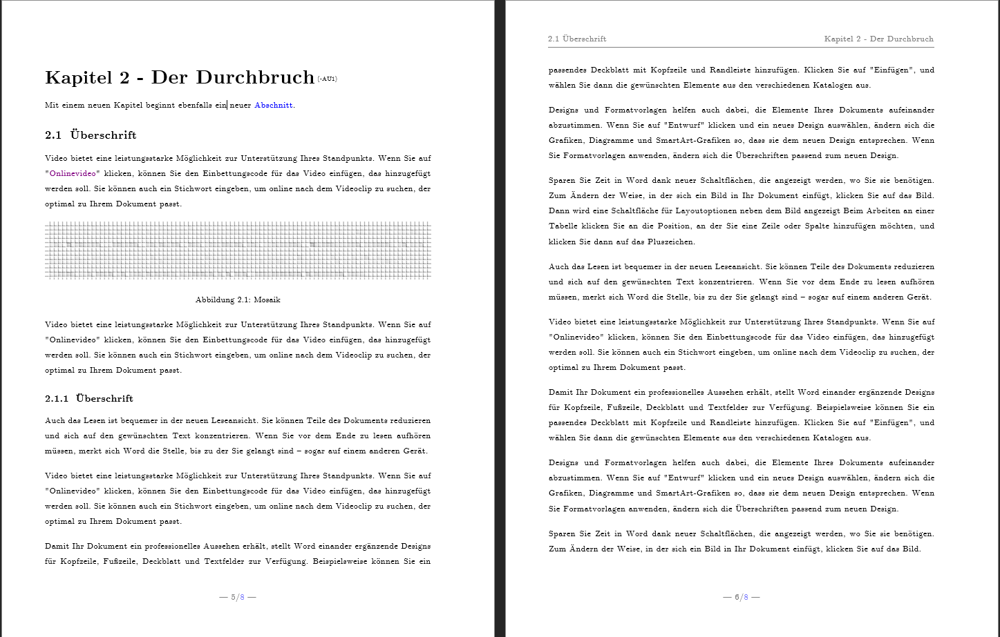

# DHBW MA - Stroetmanns LaTeX-lookalike

Einige Studenten der DHBW fehlt eine gute Vorlage zum Erstellen von wissenschaftlichen Arbeiten. Ich möchte hier eine Vorlage teilen, die vom Aussehen sehr stark am Skript des [Prof. Dr. Karl Stroetmann](https://www.mannheim.dhbw.de/suche/ansprechpersonen?tx_dhbwcontacts_contactsingleforsearch%5Baction%5D=showSingle&tx_dhbwcontacts_contactsingleforsearch%5Bcontroller%5D=Contact&tx_dhbwcontacts_contactsingleforsearch%5Bperson%5D=284&cHash=94993e0d0b7fa8843e034dc4a229809a "DHBW Mannheim: Ansprechpersonen") orientiert ist. 

Das Skript des Dozenten ist in LaTeX geschrieben, einer Satzsprache, welche hauptsächlich in wissenschaftlichen Umgebungen Anwendung findet. Auch aus diesem Grund werden viele Studenten der praxisorientierten Studiengänge damit nie in Verbindung treten. Sie können so nicht von den vielen Vorteilen von LaTeX Gebrauch machen und schreiben ihre Texte viel effizienter in Word.
Dennoch bietet LaTeX ein professionelles Erscheinungsbild der fertigen Arbeit. Charakteristika umfassen nummerierte Überschriften, eine spezielle Schriftart (computer modern) und breite Ränder.

## Installation

1. Die spezielle Schriftart herunterladen und installieren: [http://sourceforge.net/projects/cm-unicode/files/cm-unicode/0.7.0/](http://sourceforge.net/projects/cm-unicode/files/cm-unicode/0.7.0/)
2. Die Vorlage herunterladen und öffnen. Alternativ bei bestehendem Dokument als Vorlage auswählen.
Beides sollte funktionieren.

## Danksagung

Mein Dank gilt...

- [Sebastian Nilsson](https://github.com/sebnil "Sebastian Nilsson auf GitHub"), dem Ersteller des Repository [LaTeX-template-for-Word](https://github.com/sebnil/LaTeX-template-for-Word), sowie
- [Prof. Dr. Karl Stroetmann](https://github.com/karlstroetmann/ "Karl Stroetmann auf GitHub") für seine ausgezeichneten Vorlesungen und Unterlagen.
